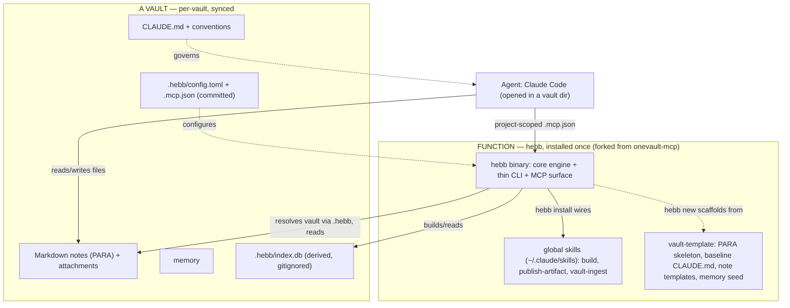

# OneVault System Architecture

How the **data** (the vault) and the **function** (the `hebb` tool, skills, automation, agent) hang together, the boundary between them, and the target that makes the function layer reproducible from a single clone, including starting a brand-new vault from scratch and running many vaults from one install. Draft for review.

Names: the **data** is a vault (e.g. OneVault). The **function** is **`hebb`**, a CLI app forked from the current `onevault-mcp` repo (`hebb` = Hebbian association, free on npm/Homebrew).

## North star: clone-and-go, multi-vault, from-scratch always possible

> Install `hebb` once. In any vault directory, run `hebb install` (attach a synced vault) or `hebb new` (scaffold a fresh one), re-auth connectors. Nothing else hand-built. Personal and work vaults are separate and self-contained.

Three guarantees:
1. **Reproducible function** — skills, scripts, schedules, MCP wiring and settings all come from the `hebb` repo, not hand-config.
2. **From-scratch always works** — `hebb new` births an empty, working vault with zero personal data. The test that function does not depend on data.
3. **Multi-vault** — one install serves many independent vaults, the way `git` serves many repos.

## Principle: data and function are separate

> A vault is **data**: markdown notes, attachments, memory, and the personalised parts of the contract. Everything that reads, indexes, searches, maintains, scaffolds or syncs it is **function** = `hebb`, one version-controlled, installable tool. Strip the machinery away and the vault is still just notes plus what the agent has learned.

The **generic** contract (PARA skeleton, baseline `CLAUDE.md`, note templates, conventions, empty memory seed) ships in the `hebb` repo; the **personal** layer (content, personalised `CLAUDE.md`, accumulated memory) is per-vault data.

Layers: **Data** (per-vault content + memory + `.hebb/` config) · **Function** (`hebb`: core engine + thin CLI + MCP surface, installed once) · **Contracts** (per-vault `.hebb/config.toml`, the project-scoped `.mcp.json`, the MCP tool surface, direct file access, `CLAUDE.md`).

## Multi-vault model

> `hebb` is multi-vault like `git` is multi-repo. Installed once; each vault is self-contained and self-describing. This is what keeps personal and work cleanly apart.

- **Per-vault marker and config:** each vault has a `.hebb/` directory at its root (like `.git`): `config.toml` (exclude dirs, web port, enabled jobs and skills, vault name), `index.db` (derived), and a generated `.mcp.json`.
- **Directory-context operation:** `hebb` walks up from the current directory to the nearest `.hebb/`, like `git`/`npm`. `cd ~/vaults/work && hebb serve`. A `--vault <path>` flag and `HEBB_VAULT` env override cover automation and headless runs.
- **Project-scoped MCP:** the `.mcp.json` committed in each vault wires that vault's `hebb` when Claude is opened there. No global MCP registration to juggle; open the work vault, get the work MCP.
- **Shared vs per-vault:**
  - Shared (function): the `hebb` binary and global skills in `~/.claude/skills`. Installed once.
  - Per-vault (data + its config): `.hebb/config.toml`, the index, memory, `CLAUDE.md`, enabled jobs, web port.
- **Personal vs work:** `hebb new ~/vaults/personal` and `hebb new ~/vaults/work` are fully independent (different content, memory, contract, even web-UI ports so both run at once).
- **Travels vs local:** commit `.hebb/config.toml` and `.mcp.json` so a cloned or synced vault self-identifies; gitignore `.hebb/index.db` and machine-local state.
- Optional global config `~/.config/hebb/` for tool defaults and a registry of known vaults.

## Tech stack: Go (decided)

`onevault-mcp` is Node, inherited not chosen. `hebb` is **Go**, chosen for distribution and headless reliability, where Node has already cost time (nvm shim, shebang-under-launchd failures, `better-sqlite3` ABI pinning).

- **Go — chosen.** Single static binary (no runtime to manage, launchd-bulletproof, trivial `brew install`), mature MCP support (`mcp-go` plus an official Go SDK), pure-Go SQLite FTS5 (no cgo), `fsnotify` watcher, stdlib HTTP for the web UI, Wails for a future GUI. Phase 1 becomes a port of the Node reference rather than a refactor.
- **Rust** if tantivy-grade search and a Tauri desktop app later are wanted, at higher dev cost.
- **Node** if reuse and shipping speed outweigh carrying the runtime fragility forward.
- **Python** only if unifying with the existing automation scripts beats distribution.

## Diagram (target)



## Component inventory (current)

### Data — a vault (e.g. `~/Documents/OneVault`, synced)
- ~1,072 markdown notes (~6MB) in PARA; attachments and data files (~233MB, the sync-phase target).
- `CLAUDE.md`, `.obsidian/`. Memory travels with the vault (symlinked into `~/.claude` by `hebb install`).
- Today the index lives at `.onevault-mcp/vault.db`; target is `.hebb/index.db`.

### Function — `hebb` (forked from `~/personal/onevault-mcp`, git `github.com/cizer/...`)
- Engine from today's `src/`: MCP server, indexer (`build-index.js`, `indexer.js`, `parser.js`), search (`search.js`), watcher (`watcher.js`), DB (`db.js`), web UI (`web.js` + `web/`). The Node reference to port to Go.
- MCP tools: `search_vault`, `get_context_for_topic`, `expand_context`, `reindex_vault`, `vault_stats`.

### Function currently OUTSIDE the repo (to be pulled into `hebb`)
- Skills `~/.claude/skills/` (unversioned), automation scripts `vault/bin/`, launchd plists `~/Library/LaunchAgents/local.onevault.*`, Claude settings/permissions, and the not-yet-existing `vault-template/`.

### Contracts (the seams)
- Per-vault `.hebb/config.toml` and project-scoped `.mcp.json` (replacing the old global `.env`/`VAULT_PATH`).
- Vault discovery by directory context (`--vault`/`HEBB_VAULT` override).
- MCP tool surface (agent to engine); direct filesystem read/write (agent to data); `CLAUDE.md` and conventions.

## Target repo shape

```
hebb/                # Go binary; onevault-mcp (Node) is the reference spec
  core/              # UI-agnostic engine: index, search, scaffold, sync, hygiene
  cli/               # thin CLI over core: new, install, sync, index, serve, doctor
  mcp/               # MCP server surface over core
  skills/            # build, publish-artifact, vault-ingest
  automation/        # action-review, digest, syncs
  launchd/           # parameterised plist templates
  config/            # settings.json + permissions template, global config defaults
  vault-template/    # PARA skeleton, baseline CLAUDE.md, note templates, memory seed
  README.md / ARCHITECTURE.md
```

## Bootstrap flow

Install `hebb` once (Homebrew/npm). Then, per vault:

- **Restore (existing vault):** `cd <vault> && hebb install` initialises `.hebb/`, writes `config.toml`, generates the project-scoped `.mcp.json`, symlinks global skills, renders and loads that vault's launchd jobs, builds the index, symlinks the memory dir.
- **Fresh:** `hebb new <path>` scaffolds a vault from `vault-template/` then installs against it.
- Re-auth connectors. The only manual step.

## Migration path (current to target)

1. Stand up `hebb` as a Go module; port the Node `onevault-mcp` engine into `core/`, with a thin `cli/` and an `mcp/` surface (goldmark, modernc SQLite FTS5, fsnotify, stdlib HTTP, mcp-go).
2. Add vault discovery (`.hebb/` upward) and the `--vault`/`HEBB_VAULT` override.
3. Move `vault/bin/*` into `hebb/automation/`; make launchd jobs per-vault (label includes vault name).
4. Move `~/.claude/skills/*` into `hebb/skills/`; symlink back via `hebb install`.
5. Relocate memory to a synced vault location; symlink into `~/.claude`.
6. Extract a generic `vault-template/` (PARA skeleton, baseline `CLAUDE.md` split from the personalised one, note templates, memory seed).
7. Build the `hebb` CLI (`new`, `install`, `sync`, `index`, `serve`, `doctor`) with per-vault `.hebb/` and `.mcp.json` generation, idempotent.
8. Confirm the index is gitignored; retire `onevault-mcp` after cutover.

## Scope

- **In scope:** vaults, `hebb` (forked from onevault-mcp), the skills, the automation, the agent, memory, the vault scaffold.
- **Out of scope:** the other `~/personal` repos. Confirmed inactive.

## Where this doc lives

Canonical copy moves into the `hebb` repo, with a pointer in the vault.
