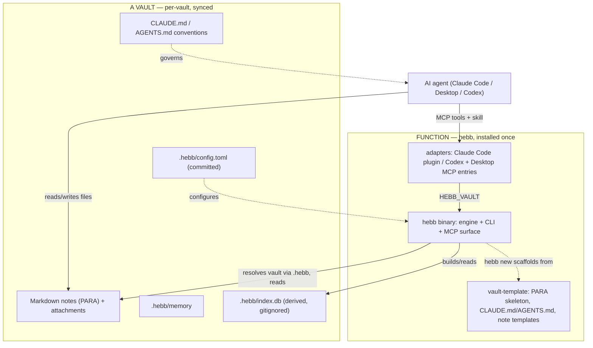

# hebb architecture

How hebb is structured, the line between your **data** (a vault) and the **function** (the tool), and the contracts between them. The guiding aim: install once, run against many independent vaults, and always be able to start a fresh one from scratch.

## Principle: data and function are separate

A **vault** is data: markdown notes, attachments, and the agent's accumulated `memory`. Everything that indexes, searches, scaffolds, or serves it is **function** — the `hebb` binary plus thin per-agent adapters. Strip the tooling away and the vault is still just your notes plus what the agent has learned.

The **generic** parts (a PARA skeleton, a baseline `CLAUDE.md`/`AGENTS.md`, note templates) ship with hebb; the **personal** layer (your content, your conventions, accumulated memory) is per-vault data. Three properties fall out of this split:

1. **Reproducible function** — MCP wiring, skills, and scaffolding come from hebb, not hand-config.
2. **From-scratch always works** — `hebb new` creates an empty, working vault with zero personal data. The proof that function doesn't depend on data.
3. **Multi-vault** — one install serves many independent vaults, the way `git` serves many repos.

## Multi-vault model

hebb is multi-vault like `git` is multi-repo: installed once, with each vault self-contained and self-describing.

- **Per-vault marker (`.hebb/`).** Each vault has a `.hebb/` directory at its root, like `.git`: `config.toml` (name, exclude dirs, web port, enabled jobs, ingest policy), the derived `index.db`, and `memory/` (the agent's memory for this vault — under `.hebb/` so it's hidden from Obsidian and excluded from the index, but still travels with the vault).
- **Directory-context operation.** hebb walks up from the working directory to the nearest `.hebb/`, like `git`. A `--vault <path>` flag and `$HEBB_VAULT` override cover automation and headless runs.
- **Travels vs local.** Commit `.hebb/config.toml` and your notes so a synced or cloned vault self-identifies; the `index.db` is derived and gitignored, rebuilt on demand.

## Engine + thin adapters

The engine and its MCP surface are identical across agents; only the adapter differs.

- **Engine** (`core/`): vault resolution, the SQLite FTS5 index, the markdown parser (frontmatter, H1 titles, `[[wiki-links]]`, tags), full-text search, the link/tag context graph, and a file watcher for incremental reindexing.
- **Surfaces over the engine**: the `hebb` CLI, an MCP server (`hebb mcp`), and a local web UI (`hebb serve`).
- **Per-agent adapters**, each pinning a vault via `HEBB_VAULT`:
  - **Claude Code** — the plugin (`plugin/`): the MCP server plus the `vault-ingest` skill. Installed once, user-level (via the marketplace), and resolves the opened vault through `HEBB_VAULT=${CLAUDE_PROJECT_DIR}`, so it serves every vault without per-vault setup.
  - **Codex** — an `[mcp_servers.hebb]` entry pinned to a vault plus the same skills installed into Codex's skills dir (`~/.agents/skills`), written by `hebb codex` (or the `hebb install` picker). The Codex counterpart to the Claude Code plugin.
  - **Claude Desktop** — an `mcpServers` entry pinned to a vault, written by the `hebb install` picker. It does not load skills, so vault guidance lives in the vault's `AGENTS.md`.
  - **Any MCP client** — point it at `hebb mcp`.
- **Standalone binary.** Automation scripts and the vault template are embedded; `install` materialises the automation to the data dir (`$XDG_DATA_HOME/hebb`, else `~/.local/share/hebb`) for launchd. No repo checkout needed at runtime.

## Diagram



## Contracts (the seams)

- **`.hebb/config.toml`** — the committed, per-vault contract (name, excludes, web port, jobs, ingest policy). Key blocks: `[git]` (auto-sync), `[update]` (auto-update), `[index]` (auto-refresh), `[ingest]` (stage 1-3 and scratch_dirs: vault-root-relative path prefixes that stay searchable but are never ingest sources, distinct from `exclude_dirs` which removes notes from the index entirely).
- **MCP tool surface** — `search_vault`, `get_context_for_topic`, `expand_context`, `vault_stats`, `reindex_vault`: how an agent reaches the engine.
- **Direct filesystem access** — the agent reads and writes the markdown itself; hebb never sits in front of the files.
- **`CLAUDE.md` / `AGENTS.md`** — per-vault conventions the agent follows.

## Tech choices

- **Go** — a single static binary (no runtime to manage, launchd-friendly, trivial to distribute), mature MCP libraries, and pure-Go SQLite FTS5 (no cgo, so cross-compilation is trivial). `fsnotify` for the watcher, stdlib HTTP for the web UI.
- **SQLite FTS5** as the index — the index *is* the product, tested against a real database rather than mocked.

## Repo shape

```
core/            engine: index, search, context graph, watcher
cli/             the hebb command
mcp/             MCP server surface
web/             local web UI (embedded)
cmd/hebb/        entrypoint
plugin/          Claude Code plugin (manifest, .mcp.json, vault-ingest skill)
automation/      optional background jobs (action review; the digest is built into `hebb digest`)
launchd/         parameterised launchd plist templates
vault-template/  the `hebb new` scaffold
```

## Bootstrap flow

Install hebb once, then per vault:

- **Existing vault:** `cd <vault> && hebb install` initialises `.hebb/`, writes `config.toml`, symlinks the memory dir, builds the index, and offers to wire your agents (and optional launchd jobs).
- **Fresh vault:** `hebb new <path>` scaffolds from the template, then installs against it.
- **Tear down:** `hebb reset` removes the machine-side wiring (memory link, launchd jobs, agent configs, index) and never touches your notes.
